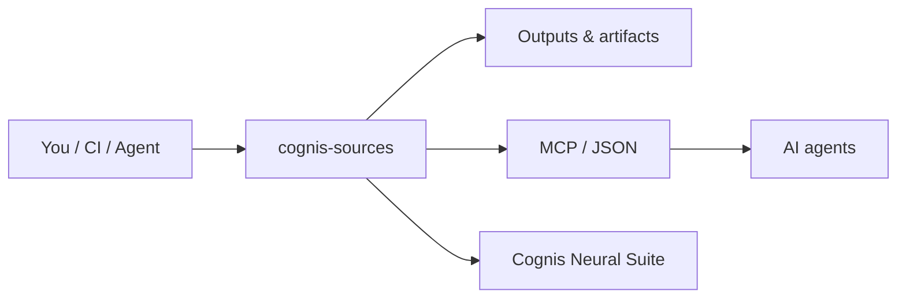

# Cognis Sources

> A curated, de-duplicated index of **public technical & research links** mined from the Cognis research corpus (atlases, dashboards) and bookmarks. **No personal data** — a hard privacy filter excludes mail/banking/social/health/private hosts.

**10,338 links** across **5,133 domains** (from 223 HTML docs + bookmarks).


## Usage — step by step

This repo is a curated link dataset (no CLI) — the index lives in `README.md`, the full machine-readable data in [`sources.json`](sources.json).

1. **Get the data:**
   ```bash
   git clone https://github.com/cognis-digital/cognis-sources && cd cognis-sources
   ```
2. **Browse by category** in this README (Security & OSINT, Government & Standards, Research & Academia, ...), each grouped by domain with link counts.
3. **Query the full index** programmatically from `sources.json` — every link grouped by domain:
   ```bash
   jq '.[] | select(.domain=="arxiv.org")' sources.json
   ```
4. **Filter for your use case** — e.g. pull every `.gov` standards domain into a feed list:
   ```bash
   jq -r 'keys[] | select(endswith(".gov"))' sources.json
   ```
5. **Feed it to agents / CI** — load `sources.json` as a seed list for a crawler, RAG ingest, or OSINT pipeline. A hard privacy filter already excludes mail/banking/social/health/private hosts, so it is safe to ingest wholesale.

## Security & OSINT (42 domains)

- **www.bellingcat.com** — 6 link(s)
- **attack.mitre.org** — 5 link(s)
- **owasp.org** — 5 link(s)
- **www.cisecurity.org** — 4 link(s)
- **entersoftsecurity.com** — 3 link(s)
- **aida.mitre.org** — 2 link(s)
- **www.mitre.org** — 2 link(s)
- **anysecurity.Co** — 1 link(s)
- **atlas.mitre.org** — 1 link(s)
- **berlin-security-conference.com** — 1 link(s)
- **blog.entersoftsecurity.com** — 1 link(s)
- **caldera.mitre.org** — 1 link(s)
- **cheatsheetseries.owasp.org** — 1 link(s)
- **ctid.mitre-engenuity.org** — 1 link(s)
- **cve.mitre.org** — 1 link(s)
- **d3fend.mitre.org** — 1 link(s)
- **darqsecurity.ai** — 1 link(s)
- **elearnsecurity.com** — 1 link(s)
- **emb3d.mitre.org** — 1 link(s)
- **engage.mitre.org** — 1 link(s)
- **genai.owasp.org** — 1 link(s)
- **kivusecurity.org** — 1 link(s)
- **krebsonsecurity.com** — 1 link(s)
- **mitre-attack.github.io** — 1 link(s)
- **opensecuritytraining.info** — 1 link(s)
- **packetstormsecurity.com** — 1 link(s)
- **securityconference.org** — 1 link(s)
- **securitylab.amnesty.org** — 1 link(s)
- **securitytraders.org** — 1 link(s)
- **securitytrails.com** — 1 link(s)
- **securityvisionmb.alarmbiller.com** — 1 link(s)
- **trufflesecurity.com** — 1 link(s)
- **www.adamosecurity.com** — 1 link(s)
- **www.aspensecurityforum.org** — 1 link(s)
- **www.centerforhealthsecurity.org** — 1 link(s)
- **www.cybersecuritycoalition.org** — 1 link(s)
- **www.justsecurity.org** — 1 link(s)
- **www.picussecurity.com** — 1 link(s)
- **www.sans.org** — 1 link(s)
- **www.securitybsides.com** — 1 link(s)
- **www.securityweek.com** — 1 link(s)
- **www.welivesecurity.com** — 1 link(s)

## Code & Repos (3 domains)

- **github.com** — 422 link(s)
- **gist.github.com** — 5 link(s)
- **gitlab.com** — 1 link(s)

## Government & Standards (440 domains)

- **www.justice.gov** — 36 link(s)
- **www.cisa.gov** — 33 link(s)
- **www.energy.gov** — 32 link(s)
- **csrc.nist.gov** — 25 link(s)
- **crsreports.congress.gov** — 24 link(s)
- **www.sec.gov** — 20 link(s)
- **sam.gov** — 19 link(s)
- **www.dhs.gov** — 18 link(s)
- **www.dni.gov** — 16 link(s)
- **www.acquisition.gov** — 15 link(s)
- **www.federalreserve.gov** — 14 link(s)
- **www.cia.gov** — 13 link(s)
- **www.fbi.gov** — 13 link(s)
- **www.fema.gov** — 13 link(s)
- **www.gsa.gov** — 13 link(s)
- **www.sba.gov** — 13 link(s)
- **www.eia.gov** — 12 link(s)
- **www.state.gov** — 12 link(s)
- **casagrandeaz.gov** — 11 link(s)
- **media.defense.gov** — 11 link(s)
- **www.congress.gov** — 11 link(s)
- **www.whitehouse.gov** — 10 link(s)
- **dodcio.defense.gov** — 9 link(s)
- **www.archives.gov** — 9 link(s)
- **www.gov.uk** — 9 link(s)
- **www.nsa.gov** — 9 link(s)
- **www.defense.gov** — 8 link(s)
- **www.usgs.gov** — 8 link(s)
- **home.treasury.gov** — 7 link(s)
- **www.bls.gov** — 7 link(s)
- **www.nasa.gov** — 7 link(s)
- **www.nist.gov** — 7 link(s)
- **www.war.gov** — 7 link(s)
- **business.defense.gov** — 6 link(s)
- **www.federalregister.gov** — 6 link(s)
- **www.pinal.gov** — 6 link(s)
- **nces.ed.gov** — 5 link(s)
- **ofac.treasury.gov** — 5 link(s)
- **www.dol.gov** — 5 link(s)
- **www.va.gov** — 5 link(s)
- **aspr.hhs.gov** — 4 link(s)
- **www.dea.gov** — 4 link(s)
- **www.fai.gov** — 4 link(s)
- **www.usaspending.gov** — 4 link(s)
- **www.usda.gov** — 4 link(s)
- **acquisitiongateway.gov** — 3 link(s)
- **science.nasa.gov** — 3 link(s)
- **science.osti.gov** — 3 link(s)
- **vsc.gsa.gov** — 3 link(s)
- **www.bea.gov** — 3 link(s)
- **www.fincen.gov** — 3 link(s)
- **www.iarpa.gov** — 3 link(s)
- **www.ncbi.nlm.nih.gov** — 3 link(s)
- **www.nps.gov** — 3 link(s)
- **www.nrel.gov** — 3 link(s)
- **www.nro.gov** — 3 link(s)
- **www.pnnl.gov** — 3 link(s)
- **www.sbir.gov** — 3 link(s)
- **www.usa.gov** — 3 link(s)
- **www.usajobs.gov** — 3 link(s)

## Research & Academia (153 domains)

- **arxiv.org** — 82 link(s)
- **ocw.mit.edu** — 25 link(s)
- **www.brookings.edu** — 6 link(s)
- **tutorial.math.lamar.edu** — 5 link(s)
- **www.airuniversity.af.edu** — 5 link(s)
- **aaf.dau.edu** — 4 link(s)
- **haarp.gi.alaska.edu** — 4 link(s)
- **www.feynmanlectures.caltech.edu** — 4 link(s)
- **crypto.stanford.edu** — 3 link(s)
- **cyber.fsi.stanford.edu** — 3 link(s)
- **hyperphysics.phy-astr.gsu.edu** — 3 link(s)
- **nsarchive.gwu.edu** — 3 link(s)
- **www.cdse.edu** — 3 link(s)
- **www.dau.edu** — 3 link(s)
- **aiindex.stanford.edu** — 2 link(s)
- **ci.coastal.edu** — 2 link(s)
- **cset.georgetown.edu** — 2 link(s)
- **dl.acm.org** — 2 link(s)
- **ieeexplore.ieee.org** — 2 link(s)
- **jsou.edu** — 2 link(s)
- **mfe.baruch.cuny.edu** — 2 link(s)
- **moodle.coastal.edu** — 2 link(s)
- **ndupress.ndu.edu** — 2 link(s)
- **people.csail.mit.edu** — 2 link(s)
- **usnwc.edu** — 2 link(s)
- **ww2.coastal.edu** — 2 link(s)
- **www.sei.cmu.edu** — 2 link(s)
- **www.ssrn.com** — 2 link(s)
- **afrotc.yalecollege.yale.edu** — 1 link(s)
- **ai.stanford.edu** — 1 link(s)
- **annals.math.princeton.edu** — 1 link(s)
- **arxiv-sanity-lite.com** — 1 link(s)
- **bair.berkeley.edu** — 1 link(s)
- **berkleycenter.georgetown.edu** — 1 link(s)
- **cacm.acm.org** — 1 link(s)
- **ccrma.stanford.edu** — 1 link(s)
- **chuck.cs.princeton.edu** — 1 link(s)
- **citap.unc.edu** — 1 link(s)
- **cor.stanford.edu** — 1 link(s)
- **crfm.stanford.edu** — 1 link(s)
- **cs50.harvard.edu** — 1 link(s)
- **cse.ucsd.edu** — 1 link(s)
- **csetechrep.ucsd.edu** — 1 link(s)
- **css.georgetown.edu** — 1 link(s)
- **ctc.westpoint.edu** — 1 link(s)
- **defense.arizona.edu** — 1 link(s)
- **digital-commons.usnwc.edu** — 1 link(s)
- **dragonfly.jhuapl.edu** — 1 link(s)
- **droughtmonitor.unl.edu** — 1 link(s)
- **dss.princeton.edu** — 1 link(s)
- **eartharxiv.org** — 1 link(s)
- **ee.stanford.edu** — 1 link(s)
- **eisenhower.ndu.edu** — 1 link(s)
- **engineering.wisc.edu** — 1 link(s)
- **ethicsunwrapped.utexas.edu** — 1 link(s)
- **faculty.evansville.edu** — 1 link(s)
- **fcic-static.law.stanford.edu** — 1 link(s)
- **finance.wharton.upenn.edu** — 1 link(s)
- **genome.ucsc.edu** — 1 link(s)
- **hai.stanford.edu** — 1 link(s)

## Documentation (34 domains)

- **docs.google.com** — 17 link(s)
- **developer.algorand.org** — 9 link(s)
- **developer.mozilla.org** — 2 link(s)
- **developer.nvidia.com** — 2 link(s)
- **docs.aurorasolar.com** — 2 link(s)
- **docs.litellm.ai** — 2 link(s)
- **docs.nvidia.com** — 2 link(s)
- **docs.openwebui.com** — 2 link(s)
- **developer.apple.com** — 1 link(s)
- **developer.purestake.io** — 1 link(s)
- **docs.alpaca.markets** — 1 link(s)
- **docs.claude.com** — 1 link(s)
- **docs.cline.bot** — 1 link(s)
- **docs.cosmos.network** — 1 link(s)
- **docs.cryptomator.org** — 1 link(s)
- **docs.developer.yelp.com** — 1 link(s)
- **docs.flashbots.net** — 1 link(s)
- **docs.literalai.com** — 1 link(s)
- **docs.metaplex.com** — 1 link(s)
- **docs.mistral.ai** — 1 link(s)
- **docs.polymarket.com** — 1 link(s)
- **docs.ray.io** — 1 link(s)
- **docs.raydium.io** — 1 link(s)
- **docs.sbossu.com** — 1 link(s)
- **docs.social.network** — 1 link(s)
- **docs.solana.com** — 1 link(s)
- **docs.trychroma.com** — 1 link(s)
- **docs.velociraptor.app** — 1 link(s)
- **docs.vllm.ai** — 1 link(s)
- **docs.web3j.io** — 1 link(s)
- **py-algorand-sdk.readthedocs.io** — 1 link(s)
- **pycryptodome.readthedocs.io** — 1 link(s)
- **www.nextdocs.io** — 1 link(s)
- **www.w3docs.com** — 1 link(s)

## Cloud & Infra (13 domains)

- **cloud.google.com** — 4 link(s)
- **aws.amazon.com** — 3 link(s)
- **azure.microsoft.com** — 2 link(s)
- **registry.opendata.aws** — 2 link(s)
- **aws.state.ak.us** — 1 link(s)
- **azureforeducation.microsoft.com** — 1 link(s)
- **console.aws.amazon.com** — 1 link(s)
- **english.aawsat.com** — 1 link(s)
- **lamport.azurewebsites.net** — 1 link(s)
- **lionclaws.com** — 1 link(s)
- **signin.aws.amazon.com** — 1 link(s)
- **www.docker.com** — 1 link(s)
- **www.lawsociety.org.nz** — 1 link(s)

## Articles & Media (36 domains)

- **www.youtube.com** — 96 link(s)
- **medium.com** — 15 link(s)
- **navnoorbawa.substack.com** — 3 link(s)
- **blog.google** — 2 link(s)
- **aletteraday.substack.com** — 1 link(s)
- **altgoesmainstream.substack.com** — 1 link(s)
- **andrewsullivan.substack.com** — 1 link(s)
- **blog.amberdata.io** — 1 link(s)
- **blog.cloudflare.com** — 1 link(s)
- **blog.feedspot.com** — 1 link(s)
- **blog.holochain.org** — 1 link(s)
- **blog.mythx.io** — 1 link(s)
- **blog.research.google** — 1 link(s)
- **blog.sekoia.io** — 1 link(s)
- **blog.technitium.com** — 1 link(s)
- **blog.us.playstation.com** — 1 link(s)
- **derivvaluation.medium.com** — 1 link(s)
- **elblogbruno.github.io** — 1 link(s)
- **fs.blog** — 1 link(s)
- **goghieas.substack.com** — 1 link(s)
- **googleprojectzero.blogspot.com** — 1 link(s)
- **greenwald.substack.com** — 1 link(s)
- **hedgevision.substack.com** — 1 link(s)
- **jessesingal.substack.com** — 1 link(s)
- **mate.substack.com** — 1 link(s)
- **music.youtube.com** — 1 link(s)
- **public.substack.com** — 1 link(s)
- **pumpparade.medium.com** — 1 link(s)
- **rupakghose.substack.com** — 1 link(s)
- **seymourhersh.substack.com** — 1 link(s)
- **solana.blog** — 1 link(s)
- **tspasemiconductor.substack.com** — 1 link(s)
- **vickyward.substack.com** — 1 link(s)
- **www.positivityblog.com** — 1 link(s)
- **youtubechanneltranscripts.com** — 1 link(s)
- **youtubetotranscript.com** — 1 link(s)

## Other (4412 domains)

- **online.fliphtml5.com** — 853 link(s)
- **en.wikipedia.org** — 704 link(s)
- **www.google.com** — 165 link(s)
- **www.genspark.ai** — 94 link(s)
- **13f.info** — 80 link(s)
- **whalewisdom.com** — 56 link(s)
- **www.linkedin.com** — 43 link(s)
- **www.reuters.com** — 38 link(s)
- **huggingface.co** — 35 link(s)
- **stockzoa.com** — 34 link(s)
- **www.darpa.mil** — 29 link(s)
- **www.nature.com** — 25 link(s)
- **finance.yahoo.com** — 22 link(s)
- **www.reddit.com** — 22 link(s)
- **www.semanticscholar.org** — 22 link(s)
- **www.csis.org** — 21 link(s)
- **www.rand.org** — 21 link(s)
- **www.bloomberg.com** — 20 link(s)
- **www.greatdreams.com** — 19 link(s)
- **home.army.mil** — 18 link(s)
- **static.cfr.org** — 18 link(s)
- **www.jcs.mil** — 18 link(s)
- **www.amazon.com** — 17 link(s)
- **hedgefollow.com** — 16 link(s)
- **www.army.mil** — 15 link(s)
- **www.nato.int** — 15 link(s)
- **www.atlanticcouncil.org** — 14 link(s)
- **www.vatican.va** — 14 link(s)
- **www.ssga.com** — 13 link(s)
- **www.cnbc.com** — 12 link(s)
- **www.dla.mil** — 12 link(s)
- **www.ft.com** — 11 link(s)
- **www.khanacademy.org** — 11 link(s)
- **www.microsoft.com** — 11 link(s)
- **www.sciencedirect.com** — 11 link(s)
- **acleddata.com** — 10 link(s)
- **openai.com** — 10 link(s)
- **rapidapi.com** — 10 link(s)
- **seekingalpha.com** — 10 link(s)
- **twitter.com** — 10 link(s)
- **www.iacr.org** — 10 link(s)
- **eprint.iacr.org** — 9 link(s)
- **www.dcsa.mil** — 9 link(s)
- **www.nvidia.com** — 9 link(s)
- **www.nytimes.com** — 9 link(s)
- **www.spoc.spaceforce.mil** — 9 link(s)
- **www.imf.org** — 8 link(s)
- **www.investopedia.com** — 8 link(s)
- **www.secnav.navy.mil** — 8 link(s)
- **www.understandingwar.org** — 8 link(s)
- **archive.org** — 7 link(s)
- **disboard.org** — 7 link(s)
- **research.darqlabs.io** — 7 link(s)
- **solana.com** — 7 link(s)
- **www.afrl.af.mil** — 7 link(s)
- **www.criticalthreats.org** — 7 link(s)
- **www.defensenews.com** — 7 link(s)
- **www.diu.mil** — 7 link(s)
- **www.geeksforgeeks.org** — 7 link(s)
- **www.gutenberg.org** — 7 link(s)

## Full index

See [`sources.json`](sources.json) for every link grouped by domain.

## How it fits



**Explore the suite →** [🗂️ all tools](https://github.com/cognis-digital/cognis-neural-suite) · [⭐ awesome-cognis](https://github.com/cognis-digital/awesome-cognis) · [🔗 cognis-sources](https://github.com/cognis-digital/cognis-sources)

## Interoperability

`{}` composes with the 300+ tool Cognis suite — JSON in/out and a shared
OpenAI-compatible `/v1` backbone. See **[INTEROP.md](INTEROP.md)** for the
suite map, composition patterns, and reference stacks.
